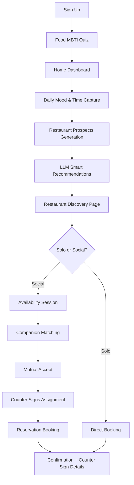

# Happy Foodie - Product Requirements Document

## 1. Product Overview
Happy Foodie is a social dining app that blends Yelp-like discovery with Hinge-like personality matching to help people "eat better together". Users discover their Food MBTI through playful onboarding, share daily mood/cravings, receive AI-powered restaurant recommendations, and connect with compatible dining companions through 2-hour availability sessions.

The app targets urban foodies aged 21-45 who seek personalized dining experiences and meaningful social connections around food, launching in SF Bay Area, LA, and NYC.

## 2. Core Features

### 2.1 User Roles
| Role | Registration Method | Core Permissions |
|------|---------------------|------------------|
| User | Phone/Apple/Google sign-in | Can complete AI-powered food tagging, receive recommendations, join availability sessions, make reservations, access all features |

### 2.2 Feature Module
Our Happy Foodie app consists of the following main pages:
1. **Onboarding Flow**: AI-powered food tagging through swiping interface, permissions setup, profile creation
2. **Home Dashboard (Daily Mood Detection)**: Weather/location-aware mood check-in, meal timing selection (2h/later), AI food suggestions, digital avatar chatbot for updates
3. **Restaurant Discovery Page**: 10 restaurant options with multiple-choice selection to pick 5 favorites
4. **Session Management**: Companion availability sessions, mutual matching, code name reveals
5. **Reservation Center**: Booking confirmation, Joy Time conversation starters, reminder management
6. **Profile Settings**: Food preferences, dietary restrictions, safety settings, streak tracking

### 2.3 Page Details
| Page Name | Module Name | Feature description |
|-----------|-------------|---------------------|
| Onboarding Flow | AI Food Tagging | Present visual swipe cards (Hinge-style) to collect comprehensive food preferences, use AI agent to analyze all inputs and generate personalized food tags (e.g., spicy, Mexican lover), create comprehensive user profile beyond single archetype |
| Onboarding Flow | Permissions Setup | Request location access, notification permissions, contact integration for safety |
| Home Dashboard (Daily Mood Detection) | Mood & Time Capture | Primary home page capturing time preferences and current general food thoughts, generates restaurant prospects based on mood analysis, weather/location detection, digital avatar chatbot for updates |
| Home Dashboard | Availability Toggle | 2-hour configurable session (30-180m) with geo-location storage and radius settings for companion matching |
| Restaurant Discovery Page | LLM Smart Recommendations | Connect directly to restaurant prospects from mood detection, use LLM to intelligently recommend exactly 10 restaurants based on captured food thoughts and time preferences, streamlined selection process |
| Discovery Page | Selection & Sharing | Allow users to star 3-5 favorites from LLM-recommended list, persist events for ML learning, share shortlist to invite companions |
| Matching Hub | Companion Matching | Uber-like matching with compatibility scoring: 35% profile similarity + 25% cuisine Jaccard + 15% MBTI lookup + 15% time overlap + 10% geo decay. Threshold ≥0.62 with dynamic relaxation |
| Matching Hub | Mutual Acceptance | Push notification system with 5-minute ephemeral timeout, mutual accept assigns creative counter signs (film lines, lyrics, quotes), opens chat with top 3 common restaurant recommendations |
| Reservation Center | Booking Integration | OpenTable/Resy adapter with fallback to manual confirmation or walk-in plans. Conflict prevention and booking reference storage |
| Reservation Center | Counter Sign Management | Generate and assign creative counter signs after successful reservations - film quotes, song lyrics, famous lines (avoiding cliche knock-knock jokes), used for identification at restaurants |
| Profile Settings | Preference Management | Dietary restrictions with zero-violation guardrails, allergy settings, cuisine preferences, safety and privacy controls |
| Profile Settings | Streak Tracking | Mood check-in streaks with heat-map visualization, weekly recaps, dining achievements, evolving avatar progression |

## 3. Core Process

**New User Onboarding Flow:**
New users sign in via phone/Apple/Google, grant location and notification permissions, complete the 10-12 card Food MBTI quiz in under 90 seconds, receive their personality result, and set up their dining preferences and safety settings.

**Daily Engagement Flow:**
Returning users land on the Home Dashboard (Daily Mood Detection page) which captures time preferences and current general food thoughts. The system generates restaurant prospects based on this mood analysis, then connects to the Restaurant Discovery page where LLM provides smart recommendations tailored to the captured preferences.

**Social Dining Flow:**
Users activate 2-hour availability sessions, system matches with top 5 compatible users based on time overlap and preferences, mutual acceptance assigns creative counter signs (film lines, lyrics, quotes), users can chat briefly before making joint reservations, and receive confirmation with counter sign details for restaurant identification.



## 4. User Interface Design

### 4.1 Design Style
- **Primary Colors**: Brand orange (#ff9e01) for energy and appetite
- **Secondary Colors**: Cream white backgrounds, charcoal gray for text
- **Button Style**: Rounded corners with subtle shadows, playful bounce animations on tap
- **Typography**: Modern sans-serif (SF Pro Display on iOS, Roboto on Android), 16-18px body text, 24-28px headers
- **Layout Style**: Card-based design with generous white space, bottom tab navigation, swipe-friendly interactions
- **Icons & Emojis**: Food-themed custom icons, personality-driven emoji reactions, animated avatars

### 4.2 Page Design Overview
| Page Name | Module Name | UI Elements |
|-----------|-------------|-------------|
| Onboarding Flow | Food MBTI Quiz | Full-screen swipe cards with high-quality food imagery, binary choice buttons, progress indicator, personality result celebration animation |
| Home Dashboard | Mood Check-in | Floating chat bubble with animated avatar, quick-select mood buttons, voice input option |
| Discovery Page | Restaurant List | Vertical card stack with restaurant photos, cuisine tags, distance/time indicators, star/share action buttons |
| Matching Hub | Compatibility View | Profile cards with compatibility percentage, shared interest tags, accept/decline swipe gestures |
| Reservation Center | Confirmation Screen | Restaurant hero image, booking details card, Joy Time topics carousel, calendar integration buttons |

### 4.3 Responsiveness
The app is mobile-first with responsive design for iOS and Android devices. Touch interactions are optimized for one-handed use with swipe gestures, haptic feedback, and accessibility support for voice commands and screen readers.

## 5. AI-Powered Food Tagging System

### 5.1 Comprehensive Preference Analysis
The AI food tagging system analyzes all user inputs from the swiping interface to generate comprehensive personality tags. Unlike traditional MBTI tests, this system creates a holistic profile that captures nuanced preferences such as "spicy food lover", "Mexican cuisine enthusiast", "comfort food seeker", etc.

### 5.2 Swiping Interface (Hinge-Style)
Users interact with visual food cards in a Hinge-style swiping interface. The AI agent processes all swipe decisions, text inputs, and preference selections to build a comprehensive understanding of the user's food personality that goes beyond simple categorization.

### 5.3 Dynamic Tag Generation
The AI system generates multiple, evolving tags that represent different aspects of the user's food preferences. These tags are used throughout the app for personalized recommendations and matching, creating a more nuanced and accurate representation than single archetype systems.

## 6. Daily Mood & Chat Avatar

### 6.1 Intent Recognition
The AI avatar captures intents including: mood_update, craving(food/cuisine), diet_change, allergy_alert, schedule_intent(now|later), invite_friends, open_session, close_session.

### 6.2 Natural Language Understanding
LLM with function-calling normalizes inputs to structured slots:
- mood_enum: {happy, stressed, tired, celebratory, cozy, adventurous}
- craving_tags: ["ramen", "pho", "sushi", "fried chicken", ...]
- time_pref and diet_flags

### 6.3 Avatar Triggers
Avatar activates on: app open, lunch/dinner hours, location change >2km, last mood >24h, upcoming session.

### 6.4 User Interface
Frictionless emoji tap for mood + quick chips for cravings with fallback text/voice input. Optional features include voice transcription and streak heat-map with weekly recaps.

## 7. Restaurant Recommendation Engine

### 7.1 Candidate Generation
Fast filtering pipeline:
1. Geo radius (3-5km, expandable for sparse areas)
2. Operating hours (Now/2h vs Later Today buckets)
3. Diet/allergy hard filters (zero violations)
4. Cuisine taxonomy matching with synonyms
5. Quality gates: rating ≥4.0, minimum reviews, hygiene flags
6. Availability: walk_in_flag OR restaurant_slots ≥ party_size

### 7.2 Ranking Features
- Distance and travel time estimates
- Profile cuisine overlap (Jaccard, TF-IDF)
- Food MBTI compatibility lookup
- Mood/craving overlap (embedding cosine similarity)
- Popularity prior (citywise Bayesian rating)
- Price fit to user sensitivity
- Novelty/diversity vs user history (MMR diversification)
- Real-time trends (recent saves/reservations)

### 7.3 Scoring Formula
```
score = 0.25 * cuisine_overlap + 0.15 * mood_match + 0.10 * mbti_compat + 
        0.15 * availability + 0.15 * proximity + 0.10 * popularity + 
        0.05 * price_fit + 0.05 * novelty
```
Re-ranking ensures ≥3 cuisine clusters in top-10. Cold-start uses city "editor's picks" and trending restaurants.

## 8. Companion Matching System

### 8.1 Session Model
Users toggle "Available" for configurable 30-180 minute sessions with stored lat/lng and radius. Session states: open → proposed → matched → booked/closed/expired.

### 8.2 Compatibility Scoring
- S_profile: cosine(user_pref_embedding_a, user_pref_embedding_b)
- S_cuisine: Jaccard(top_k_cuisines_a, top_k_cuisines_b)
- S_mbti: lookup table (0..1 compatibility)
- S_time: overlap(duration) / session_length
- S_geo: distance decay within radius

**Total Score**: `score_match = 0.35*S_profile + 0.25*S_cuisine + 0.15*S_mbti + 0.15*S_time + 0.10*S_geo`

### 8.3 Matchmaking Process
1. Queue open sessions by city using KD-tree geo indexing
2. Find top-K candidates not already proposed (threshold ≥0.62)
3. Send push invites with 5-minute ephemeral timeout
4. Mutual accept creates match with code names and top 3 common restaurant recommendations
5. No response triggers expiration and re-queuing with relaxed thresholds

## 9. Counter Signs System

### 9.1 Creative Counter Sign Generation
After successful matching and reservation confirmation, the system assigns creative counter signs to matched users for restaurant identification. These signs avoid cliche formats like knock-knock jokes and instead use:
- Film quotes and memorable movie lines
- Song lyrics from popular or meaningful songs
- Famous quotes from literature, history, or philosophy
- Iconic lines from TV shows or cultural references

### 9.2 Counter Sign Categories
- **Film Lines**: "I'll be back" / "Hasta la vista, baby" (Terminator)
- **Song Lyrics**: "Is this the real life?" / "Is this just fantasy?" (Queen)
- **Literary Quotes**: "It was the best of times" / "It was the worst of times" (Dickens)
- **Cultural References**: "That's what she said" / "Bears, beets, Battlestar Galactica" (The Office)

### 9.3 Usage at Restaurants
Counter signs serve as discrete identification methods at restaurants. Users approach their dining companion using their assigned counter sign, creating a fun, memorable way to connect while maintaining privacy until the actual meeting.

## 10. Sample Data Requirements

### 10.1 LLM-Generated Restaurant Database
The system requires a comprehensive restaurant database populated with LLM-generated examples. These samples should include diverse cuisines, price ranges, locations, and detailed metadata to support the recommendation engine without requiring manual database creation.

### 10.2 Demo User Data
For demonstration purposes, the system needs populated user profiles with varied food preferences, MBTI tags, and interaction histories. This demo data should showcase the full range of user types and matching scenarios.

### 10.3 Sample Data Structure
- Restaurant profiles with cuisine types, price ranges, location data, and compatibility tags
- User profiles with diverse food preferences and AI-generated personality tags
- Historical interaction data to demonstrate recommendation accuracy
- Sample mood check-ins and session data for matching demonstrations
- Counter sign database with categorized creative signs for matching scenarios

## 11. Reservation & Confirmation System

### 11.1 Booking Flows
- **Primary**: OpenTable/Resy adapter for slot queries and booking creation
- **Fallback**: Manual confirmation (call/email) or walk-in plans with checklists
- **Conflict Prevention**: Double booking prevention within overlapping windows

### 11.2 Confirmation Templates
**Subject**: "Your table is set: {{restaurant_name}} on {{date}} {{time}}"

**Content Structure**:
- Booking details: restaurant, date/time, reference number
- Venue information: address with map link
- Guest list: first names with counter signs
- Management links: modify/cancel options
- Arrival guidance: 10 minutes early, 15-minute hold policy
- Dress code (if applicable)
- Counter sign details: your assigned sign and how to use it for identification

**Delivery Requirements**: Push notification within 5 seconds, SMS/email within 30 seconds of booking success.