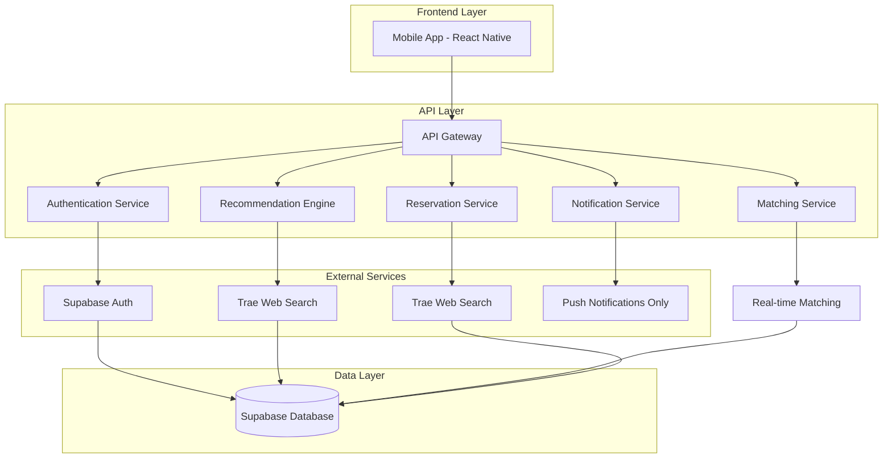
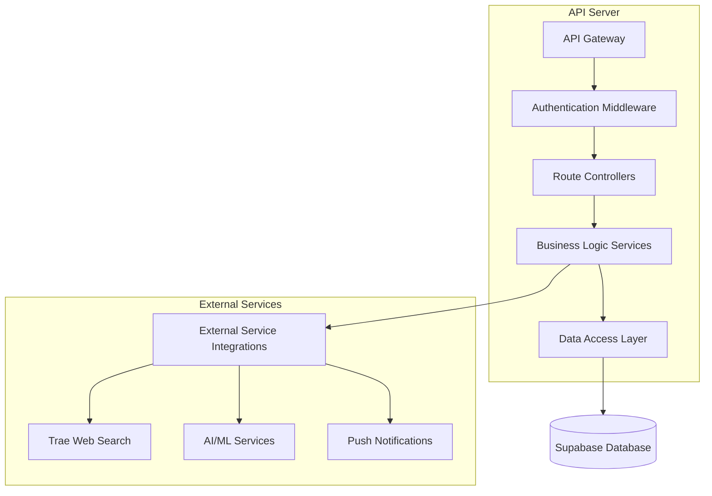
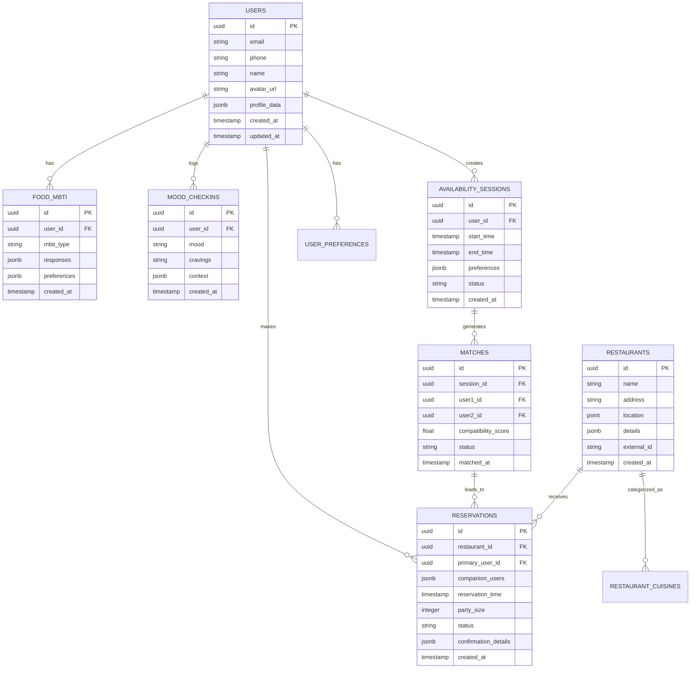

# Happy Foodie - Technical Architecture Document

## 1. Architecture Design



## 2. Technology Description

* **Frontend**: React Native\@0.72 + TypeScript + React Navigation + React Query

* **Backend**: Node.js\@18 + Express\@4 + TypeScript

* **Database**: Supabase (PostgreSQL) with real-time subscriptions

* **Authentication**: Supabase Auth with social login providers

* **AI/ML**: OpenAI GPT-4 for NLU and recommendations + custom embedding models

* **Notifications**: Firebase Cloud Messaging (push notifications only)

* **Restaurant Data**: Trae Web Search for restaurant discovery, images, and data

* **Maps**: Google Maps API for location services

## 3. Route Definitions

| Route         | Purpose                                               |
| ------------- | ----------------------------------------------------- |
| /onboarding   | Food MBTI quiz and initial setup                      |
| /home         | Main dashboard with mood check-in and recommendations |
| /discover     | Restaurant discovery and filtering                    |
| /matching     | Companion matching and availability sessions          |
| /reservations | Booking management and confirmations                  |
| /profile      | User preferences and settings                         |
| /chat         | In-app messaging for matched companions               |

## 4. API Definitions

### 4.1 Core APIs

**User Authentication**

```
POST /api/auth/signup
```

Request:

| Param Name | Param Type | isRequired | Description                 |
| ---------- | ---------- | ---------- | --------------------------- |
| provider   | string     | true       | 'phone', 'google', 'apple'  |
| credential | string     | true       | Phone number or OAuth token |
| profile    | object     | false      | Initial profile data        |

Response:

| Param Name     | Param Type | Description                 |
| -------------- | ---------- | --------------------------- |
| user           | object     | User profile data           |
| session        | object     | Authentication session      |
| mbti\_required | boolean    | Whether Food MBTI is needed |

**AI Food Tagging**

```
POST /api/food-tagging/analyze
```

Request:

| Param Name         | Param Type | isRequired | Description                              |
| ------------------ | ---------- | ---------- | ---------------------------------------- |
| swipe\_data        | array      | true       | Array of swipe decisions and preferences |
| user\_id           | string     | true       | User identifier                          |
| additional\_inputs | object     | false      | Text inputs and other preference data    |

Response:

| Param Name          | Param Type | Description                                                            |
| ------------------- | ---------- | ---------------------------------------------------------------------- |
| food\_tags          | array      | Generated personality tags (e.g., "spicy lover", "Mexican enthusiast") |
| preference\_profile | object     | Comprehensive food preference analysis                                 |
| confidence\_scores  | object     | AI confidence in each generated tag                                    |

**Restaurant Recommendations (via Trae Web Search)**

```
GET /api/recommendations
```

Request:

| Param Name    | Param Type | isRequired | Description                  |
| ------------- | ---------- | ---------- | ---------------------------- |
| user\_id      | string     | true       | User identifier              |
| time\_window  | string     | true       | 'now', '2hours', 'later'     |
| location      | object     | true       | Lat/lng coordinates          |
| mood          | string     | false      | Current mood state           |
| cuisine\_type | string     | false      | Preferred cuisine for search |

Response:

| Param Name      | Param Type | Description                                        |
| --------------- | ---------- | -------------------------------------------------- |
| restaurants     | array      | Ranked restaurant list with images from web search |
| reasoning       | string     | AI explanation for recommendations                 |
| search\_results | object     | Raw web search data with restaurant images         |

**Companion Matching**

```
POST /api/matching/session
```

Request:

| Param Name           | Param Type | isRequired | Description                       |
| -------------------- | ---------- | ---------- | --------------------------------- |
| user\_id             | string     | true       | User identifier                   |
| availability\_window | object     | true       | Start/end time for availability   |
| preferences          | object     | true       | Cuisine and companion preferences |

Response:

| Param Name         | Param Type | Description                 |
| ------------------ | ---------- | --------------------------- |
| session\_id        | string     | Matching session identifier |
| potential\_matches | array      | Compatible users list       |
| expires\_at        | string     | Session expiration time     |

**Mood & Time Capture with Restaurant Prospects**

```
POST /api/mood/capture-prospects
```

Request:

| Param Name       | Param Type | isRequired | Description                                |
| ---------------- | ---------- | ---------- | ------------------------------------------ |
| user\_id         | string     | true       | User identifier                            |
| location         | object     | true       | Current lat/lng coordinates                |
| time\_preference | string     | true       | '2h' for soon or 'later' for later today   |
| food\_thoughts   | string     | false      | Current general food thoughts and cravings |
| weather\_data    | object     | false      | Current weather conditions                 |

Response:

| Param Name            | Param Type | Description                                           |
| --------------------- | ---------- | ----------------------------------------------------- |
| restaurant\_prospects | array      | Generated restaurant prospects based on mood and time |
| mood\_analysis        | object     | Analyzed mood and food thoughts                       |
| timing\_context       | object     | Time-based dining recommendations                     |

**Mood Avatar Processing**

```
POST /api/mood/process
```

Request:

| Param Name       | Param Type | isRequired | Description                |
| ---------------- | ---------- | ---------- | -------------------------- |
| user\_id         | string     | true       | User identifier            |
| input\_text      | string     | false      | Natural language input     |
| emoji\_selection | string     | false      | Selected mood emoji        |
| voice\_data      | string     | false      | Base64 encoded voice input |

Response:

| Param Name       | Param Type | Description                    |
| ---------------- | ---------- | ------------------------------ |
| extracted\_mood  | string     | Normalized mood enum           |
| craving\_tags    | array      | Detected food/cuisine cravings |
| time\_preference | string     | Now/later dining intent        |
| diet\_flags      | array      | Any diet changes or alerts     |

**LLM Smart Restaurant Recommendations (via Trae Web Search)**

```
POST /api/discovery/llm-recommendations
```

Request:

| Param Name            | Param Type | isRequired | Description                              |
| --------------------- | ---------- | ---------- | ---------------------------------------- |
| user\_id              | string     | true       | User identifier                          |
| restaurant\_prospects | array      | true       | Restaurant prospects from mood detection |
| food\_thoughts        | string     | true       | Captured general food thoughts           |
| time\_preference      | string     | true       | '2h' for soon or 'later' for later today |
| location              | object     | true       | Current lat/lng coordinates              |

Response:

| Param Name           | Param Type | Description                                                       |
| -------------------- | ---------- | ----------------------------------------------------------------- |
| llm\_recommendations | array      | Exactly 10 LLM-curated restaurant options with web-sourced images |
| reasoning            | string     | LLM explanation for recommendations                               |
| web\_search\_data    | object     | Restaurant data and images from Trae web search                   |

**Companion Matching with Counter Signs**

```
POST /api/matching/find-companions
```

Request:

| Param Name               | Param Type | isRequired | Description                        |
| ------------------------ | ---------- | ---------- | ---------------------------------- |
| session\_id              | string     | true       | Availability session ID            |
| compatibility\_threshold | number     | false      | Minimum match score (default 0.62) |
| max\_candidates          | number     | false      | Maximum matches to return          |

Response:

| Param Name               | Param Type | Description                       |
| ------------------------ | ---------- | --------------------------------- |
| potential\_matches       | array      | Compatible users with scores      |
| compatibility\_breakdown | object     | Detailed scoring components       |
| estimated\_wait\_time    | number     | Expected matching time in minutes |

**Counter Sign Generation**

```
POST /api/matching/generate-counter-signs
```

Request:

| Param Name        | Param Type | isRequired | Description                              |
| ----------------- | ---------- | ---------- | ---------------------------------------- |
| match\_id         | string     | true       | Match identifier                         |
| user\_preferences | object     | true       | Both users' interests and preferences    |
| sign\_type        | string     | false      | 'film', 'lyrics', 'quotes', 'literature' |

Response:

| Param Name          | Param Type | Description                            |
| ------------------- | ---------- | -------------------------------------- |
| counter\_signs      | object     | Creative counter signs for both users  |
| sign\_category      | string     | Type of counter sign generated         |
| usage\_instructions | string     | How to use counter signs at restaurant |

**Reservation Booking**

```
POST /api/reservations/book
```

Request:

| Param Name      | Param Type | isRequired | Description                             |
| --------------- | ---------- | ---------- | --------------------------------------- |
| restaurant\_id  | string     | true       | Restaurant identifier                   |
| party\_size     | number     | true       | Number of diners                        |
| date\_time      | string     | true       | Reservation date/time                   |
| companions      | array      | false      | Matched companion user IDs              |
| booking\_source | string     | true       | 'opentable', 'resy', 'manual', 'walkin' |

Response:

| Param Name            | Param Type | Description                                     |
| --------------------- | ---------- | ----------------------------------------------- |
| reservation\_id       | string     | Booking confirmation ID                         |
| confirmation\_details | object     | Restaurant and booking info                     |
| joy\_time\_topics     | array      | Conversation starters based on shared interests |
| notification\_status  | object     | Push/SMS/email delivery status                  |

## 5. Server Architecture Diagram



## 6. Data Model

### 6.1 Data Model Definition



### 6.2 Data Definition Language

**Users Table**

```sql
-- Create users table
CREATE TABLE users (
    id UUID PRIMARY KEY DEFAULT gen_random_uuid(),
    email VARCHAR(255) UNIQUE,
    phone VARCHAR(20) UNIQUE,
    name VARCHAR(100) NOT NULL,
    avatar_url TEXT,
    profile_data JSONB DEFAULT '{}',
    created_at TIMESTAMP WITH TIME ZONE DEFAULT NOW(),
    updated_at TIMESTAMP WITH TIME ZONE DEFAULT NOW()
);

-- Enable RLS
ALTER TABLE users ENABLE ROW LEVEL SECURITY;

-- Create policies
CREATE POLICY "Users can view own profile" ON users
    FOR SELECT USING (auth.uid() = id);

CREATE POLICY "Users can update own profile" ON users
    FOR UPDATE USING (auth.uid() = id);

-- Grant permissions
GRANT SELECT ON users TO anon;
GRANT ALL PRIVILEGES ON users TO authenticated;
```

**Food MBTI Table**

```sql
-- Create AI food tagging table
CREATE TABLE food_tags (
    id UUID PRIMARY KEY DEFAULT gen_random_uuid(),
    user_id UUID REFERENCES users(id) ON DELETE CASCADE,
    generated_tags TEXT[] NOT NULL, -- ["spicy lover", "Mexican enthusiast", "comfort food seeker"]
    preference_profile JSONB NOT NULL, -- comprehensive analysis of food preferences
    confidence_scores JSONB DEFAULT '{}', -- AI confidence in each tag
    swipe_data JSONB NOT NULL, -- raw swipe decisions and inputs
    last_updated TIMESTAMP WITH TIME ZONE DEFAULT NOW(),
    created_at TIMESTAMP WITH TIME ZONE DEFAULT NOW()
);

-- Create sample data tables for LLM-generated content
CREATE TABLE sample_restaurants (
    id UUID PRIMARY KEY DEFAULT gen_random_uuid(),
    name VARCHAR(255) NOT NULL,
    cuisine_type VARCHAR(100) NOT NULL,
    price_range VARCHAR(10) NOT NULL,
    location POINT NOT NULL,
    address TEXT NOT NULL,
    compatibility_tags TEXT[] DEFAULT '{}',
    generated_metadata JSONB DEFAULT '{}',
    is_sample_data BOOLEAN DEFAULT true,
    created_at TIMESTAMP WITH TIME ZONE DEFAULT NOW()
);

CREATE TABLE demo_users (
    id UUID PRIMARY KEY DEFAULT gen_random_uuid(),
    name VARCHAR(100) NOT NULL,
    food_tags TEXT[] DEFAULT '{}',
    preference_profile JSONB DEFAULT '{}',
    sample_interactions JSONB DEFAULT '{}',
    is_demo_data BOOLEAN DEFAULT true,
    created_at TIMESTAMP WITH TIME ZONE DEFAULT NOW()
);

-- Create mood check-ins table with restaurant prospects
CREATE TABLE mood_checkins (
    id UUID PRIMARY KEY DEFAULT gen_random_uuid(),
    user_id UUID REFERENCES users(id) ON DELETE CASCADE,
    mood_enum VARCHAR(20) NOT NULL CHECK (mood_enum IN ('happy', 'stressed', 'tired', 'celebratory', 'cozy', 'adventurous')),
    craving_tags TEXT[] DEFAULT '{}',
    time_preference VARCHAR(10) CHECK (time_preference IN ('now', '2hours', 'later')),
    food_thoughts TEXT,
    restaurant_prospects JSONB DEFAULT '[]',
    diet_flags TEXT[] DEFAULT '{}',
    input_method VARCHAR(10) CHECK (input_method IN ('emoji', 'text', 'voice', 'chips')),
    raw_input TEXT,
    processed_intents JSONB DEFAULT '{}',
    created_at TIMESTAMP WITH TIME ZONE DEFAULT NOW()
);

-- Create counter signs table
CREATE TABLE counter_signs (
    id UUID PRIMARY KEY DEFAULT gen_random_uuid(),
    match_id UUID REFERENCES matches(id) ON DELETE CASCADE,
    user1_sign TEXT NOT NULL,
    user2_sign TEXT NOT NULL,
    sign_category VARCHAR(20) NOT NULL CHECK (sign_category IN ('film', 'lyrics', 'quotes', 'literature')),
    source_reference TEXT,
    usage_instructions TEXT,
    is_active BOOLEAN DEFAULT true,
    created_at TIMESTAMP WITH TIME ZONE DEFAULT NOW()
);

-- Create indexes
CREATE INDEX idx_food_mbti_user_id ON food_mbti(user_id);
CREATE INDEX idx_food_mbti_archetype ON food_mbti(archetype_name);
CREATE INDEX idx_mood_checkins_user_id ON mood_checkins(user_id);
CREATE INDEX idx_mood_checkins_created_at ON mood_checkins(created_at DESC);
CREATE INDEX idx_mood_checkins_mood ON mood_checkins(mood_enum);

-- Enable RLS and create policies
ALTER TABLE food_mbti ENABLE ROW LEVEL SECURITY;
CREATE POLICY "Users can manage own MBTI" ON food_mbti
    FOR ALL USING (auth.uid() = user_id);

ALTER TABLE mood_checkins ENABLE ROW LEVEL SECURITY;
CREATE POLICY "Users can manage own mood checkins" ON mood_checkins
    FOR ALL USING (auth.uid() = user_id);

GRANT SELECT ON mbti_archetypes TO anon;
GRANT ALL PRIVILEGES ON food_mbti TO authenticated;
GRANT ALL PRIVILEGES ON mood_checkins TO authenticated;
```

**Availability Sessions Table**

```sql
-- Create availability_sessions table with enhanced matching
CREATE TABLE availability_sessions (
    id UUID PRIMARY KEY DEFAULT gen_random_uuid(),
    user_id UUID REFERENCES users(id) ON DELETE CASCADE,
    start_time TIMESTAMP WITH TIME ZONE NOT NULL,
    end_time TIMESTAMP WITH TIME ZONE NOT NULL,
    location POINT NOT NULL,
    radius_km INTEGER DEFAULT 5,
    cuisine_preferences TEXT[] DEFAULT '{}',
    party_size_max INTEGER DEFAULT 2,
    compatibility_threshold DECIMAL(3,2) DEFAULT 0.62,
    status VARCHAR(20) DEFAULT 'open' CHECK (status IN ('open', 'proposed', 'matched', 'booked', 'expired', 'cancelled')),
    match_attempts INTEGER DEFAULT 0,
    last_match_attempt TIMESTAMP WITH TIME ZONE,
    created_at TIMESTAMP WITH TIME ZONE DEFAULT NOW()
);

-- Create enhanced matches table with counter signs
CREATE TABLE matches (
    id UUID PRIMARY KEY DEFAULT gen_random_uuid(),
    session_id UUID REFERENCES availability_sessions(id) ON DELETE CASCADE,
    user1_id UUID REFERENCES users(id) ON DELETE CASCADE,
    user2_id UUID REFERENCES users(id) ON DELETE CASCADE,
    compatibility_score DECIMAL(4,3) NOT NULL,
    score_breakdown JSONB NOT NULL, -- {profile: 0.85, cuisine: 0.72, mbti: 0.65, time: 1.0, geo: 0.90}
    status VARCHAR(20) DEFAULT 'proposed' CHECK (status IN ('proposed', 'accepted', 'declined', 'expired')),
    common_restaurants JSONB DEFAULT '[]',
    expires_at TIMESTAMP WITH TIME ZONE NOT NULL,
    matched_at TIMESTAMP WITH TIME ZONE DEFAULT NOW()
);

-- Create web search results cache (simplified for demo)
CREATE TABLE web_search_cache (
    id UUID PRIMARY KEY DEFAULT gen_random_uuid(),
    search_query VARCHAR(255) NOT NULL,
    location_hash VARCHAR(32) NOT NULL,
    search_results JSONB NOT NULL, -- Raw web search data with restaurant images
    expires_at TIMESTAMP WITH TIME ZONE NOT NULL,
    created_at TIMESTAMP WITH TIME ZONE DEFAULT NOW()
);

-- Create reservation confirmations table
CREATE TABLE reservation_confirmations (
    id UUID PRIMARY KEY DEFAULT gen_random_uuid(),
    reservation_id UUID REFERENCES reservations(id) ON DELETE CASCADE,
    confirmation_template JSONB NOT NULL,
    joy_time_topics TEXT[] DEFAULT '{}',
    shared_interests TEXT[] DEFAULT '{}',
    notification_channels JSONB DEFAULT '{}', -- {push: true, sms: true, email: true}
    delivery_status JSONB DEFAULT '{}',
    sent_at TIMESTAMP WITH TIME ZONE,
    created_at TIMESTAMP WITH TIME ZONE DEFAULT NOW()
);

-- Create indexes
CREATE INDEX idx_availability_sessions_user_id ON availability_sessions(user_id);
CREATE INDEX idx_availability_sessions_time_range ON availability_sessions(start_time, end_time);
CREATE INDEX idx_availability_sessions_status ON availability_sessions(status);
CREATE INDEX idx_availability_sessions_location ON availability_sessions USING GIST(location);
CREATE INDEX idx_matches_session_id ON matches(session_id);
CREATE INDEX idx_matches_users ON matches(user1_id, user2_id);
CREATE INDEX idx_matches_status ON matches(status);
CREATE INDEX idx_counter_signs_match_id ON counter_signs(match_id);
CREATE INDEX idx_counter_signs_active ON counter_signs(is_active);
CREATE INDEX idx_web_search_cache_query ON web_search_cache(search_query, location_hash);
CREATE INDEX idx_web_search_cache_expires ON web_search_cache(expires_at);
CREATE INDEX idx_reservation_confirmations_reservation_id ON reservation_confirmations(reservation_id);

-- Enable RLS
ALTER TABLE availability_sessions ENABLE ROW LEVEL SECURITY;
CREATE POLICY "Users can manage own sessions" ON availability_sessions
    FOR ALL USING (auth.uid() = user_id);

ALTER TABLE matches ENABLE ROW LEVEL SECURITY;
CREATE POLICY "Users can view own matches" ON matches
    FOR SELECT USING (auth.uid() = user1_id OR auth.uid() = user2_id);

ALTER TABLE web_search_cache ENABLE ROW LEVEL SECURITY;
CREATE POLICY "Public can access search cache" ON web_search_cache
    FOR SELECT USING (true);

ALTER TABLE reservation_confirmations ENABLE ROW LEVEL SECURITY;
CREATE POLICY "Users can view own confirmations" ON reservation_confirmations
    FOR SELECT USING (auth.uid() IN (SELECT primary_user_id FROM reservations WHERE id = reservation_id));

GRANT ALL PRIVILEGES ON availability_sessions TO authenticated;
GRANT ALL PRIVILEGES ON matches TO authenticated;
GRANT SELECT ON web_search_cache TO anon;
GRANT ALL PRIVILEGES ON web_search_cache TO authenticated;
GRANT ALL PRIVILEGES ON reservation_confirmations TO authenticated;
```

**Initial Data**

```sql
-- Insert Food MBTI archetypes with dimension profiles
INSERT INTO mbti_archetypes (archetype_name, description, dimension_profile, compatibility_matrix) VALUES
('Bold Explorer', 'Adventurous foodie who loves trying new cuisines and spontaneous dining', 
 '{"adventurous": 0.9, "spontaneous": 0.8, "street": 0.6, "savory": 0.7, "heat": 0.8}',
 '{"Bold Explorer": 0.95, "Street Maverick": 0.85, "Cozy Traditionalist": 0.3}'),
('Cozy Traditionalist', 'Prefers familiar flavors, planned dining, and comfortable atmospheres',
 '{"adventurous": -0.7, "spontaneous": -0.8, "street": -0.5, "savory": 0.4, "heat": -0.6}',
 '{"Cozy Traditionalist": 0.95, "Comfort Seeker": 0.9, "Bold Explorer": 0.3}'),
('Street Maverick', 'Loves street food, casual dining, and authentic local flavors',
 '{"adventurous": 0.6, "spontaneous": 0.7, "street": 0.9, "savory": 0.8, "heat": 0.5}',
 '{"Street Maverick": 0.95, "Bold Explorer": 0.85, "Fine Dining Enthusiast": 0.2}'),
('Fine Dining Enthusiast', 'Appreciates upscale restaurants, planned experiences, and culinary artistry',
 '{"adventurous": 0.4, "spontaneous": -0.6, "street": -0.8, "savory": 0.3, "heat": 0.2}',
 '{"Fine Dining Enthusiast": 0.95, "Gourmet Explorer": 0.8, "Street Maverick": 0.2}'),
('Sweet Tooth Adventurer', 'Loves desserts, sweet flavors, and trying new confections',
 '{"adventurous": 0.7, "spontaneous": 0.5, "street": 0.3, "savory": -0.8, "heat": -0.3}',
 '{"Sweet Tooth Adventurer": 0.95, "Dessert Lover": 0.9, "Spice Warrior": 0.1}'),
('Spice Warrior', 'Seeks the hottest dishes and loves intense, fiery flavors',
 '{"adventurous": 0.8, "spontaneous": 0.6, "street": 0.7, "savory": 0.9, "heat": 0.95}',
 '{"Spice Warrior": 0.95, "Bold Explorer": 0.8, "Sweet Tooth Adventurer": 0.1}');

-- Insert sample web search cache data for demo
INSERT INTO web_search_cache (search_query, location_hash, search_results, expires_at) VALUES
('restaurants near San Francisco', 'sf_downtown', 
 '{
"restaurants": [
{"name": "Tartine Bakery", "cuisine": "Bakery", "image_url": "https://example.com/tartine.jpg", "rating": 4.5},
{"name": "State Bird Provisions", "cuisine": "American", "image_url": "https://example.com/statebird.jpg", "rating": 4.7},
{"name": "Mission Chinese Food", "cuisine": "Chinese", "image_url": "https://example.com/mission.jpg", "rating": 4.3}
]}', NOW() + INTERVAL '24 hours'),
('sushi restaurants San Francisco', 'sf_downtown', 
 '{
"restaurants": [
{"name": "Omakase", "cuisine": "Japanese", "image_url": "https://example.com/omakase.jpg", "rating": 4.8},
{"name": "Sushi Nakazawa", "cuisine": "Japanese", "image_url": "https://example.com/nakazawa.jpg", "rating": 4.6}
]}', NOW() + INTERVAL '24 hours');

-- Insert sample mood check-in data
INSERT INTO mood_checkins (user_id, mood_enum, craving_tags, time_preference, input_method, raw_input) VALUES
('550e8400-e29b-41d4-a716-446655440000', 'adventurous', ARRAY['sushi', 'ramen'], 'now', 'emoji', '🍜😋'),
('550e8400-e29b-41d4-a716-446655440001', 'cozy', ARRAY['pasta', 'wine'], 'later', 'text', 'feeling like comfort food tonight'),
('550e8400-e29b-41d4-a716-446655440002', 'celebratory', ARRAY['champagne', 'dessert'], '2hours', 'voice', 'celebrating promotion, want something special');

-- Insert sample availability sessions
INSERT INTO availability_sessions (user_id, start_time, end_time, location, cuisine_preferences, status) VALUES
('550e8400-e29b-41d4-a716-446655440000', NOW(), NOW() + INTERVAL '2 hours', POINT(-122.4194, 37.7749), ARRAY['Japanese', 'Korean'], 'open'),
('550e8400-e29b-41d4-a716-446655440001', NOW() + INTERVAL '1 hour', NOW() + INTERVAL '3 hours', POINT(-122.4083, 37.7849), ARRAY['Italian', 'French'], 'open');
```

```
```

